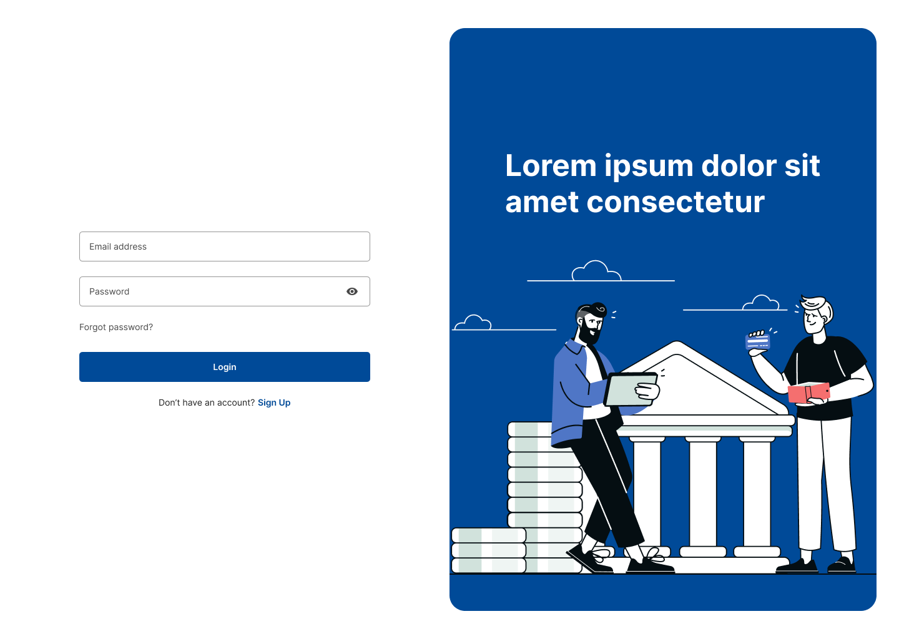
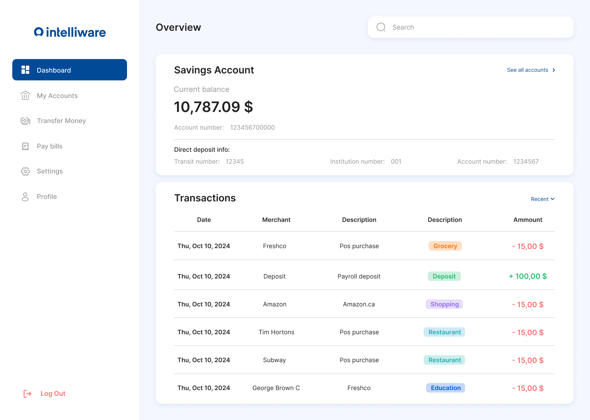
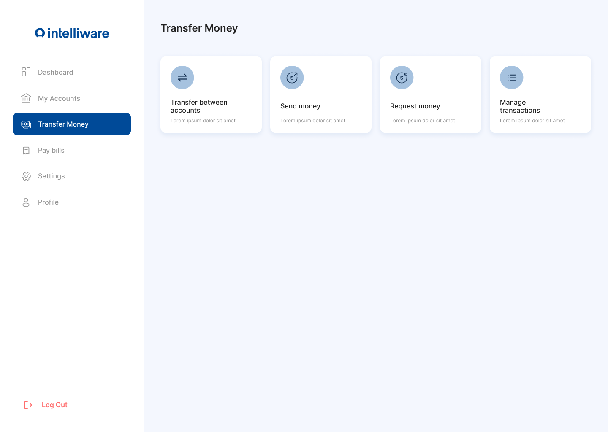
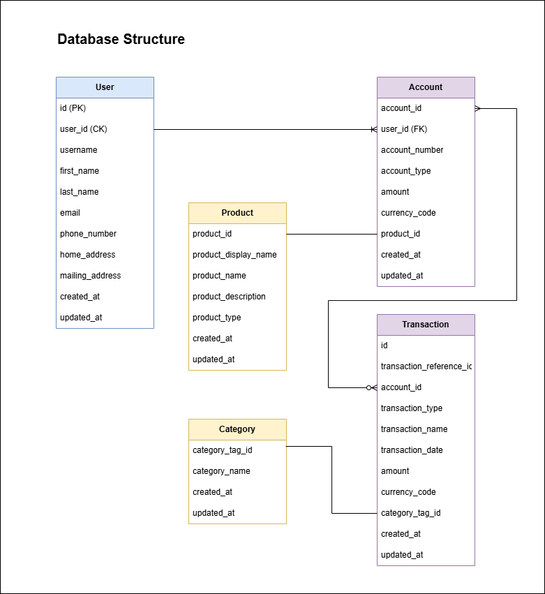

# IntelliHive Financial Dashboard
As part of Intelliware and [happy hive](https://happyhive.work/) challenge

## Demo Video Link: [YouTube](https://youtu.be/Stbytys3Bxo)
Visit our demo website 👉 https://financial-dashboard-seven-sigma.vercel.app/ 👈

<p>
  
   
</p>

[More Screenshot](https://github.com/neginheidarii/Financial-Dashboard/tree/42d0c6b79cb29b830381f4fc704212bf6510f244/Screenshots)

## Backend-Deployed Endpoints:
- **User-service**: [https://financial-dashboard-backend-user-service.onrender.com](https://financial-dashboard-backend-user-service.onrender.com)
- **Account-service**: [https://financial-dashboard-backend-user-service.onrender.com](https://financial-dashboard-backend-account.onrender.com)
- **Transaction-service**: [https://financial-dashboard-backend-user-service.onrender.com](https://financial-dashboard-backend-transaction.onrender.com)

## Meet the Team - The Avengers 👋
- **Business Systems Analyst**: [Pete Umpaipant](https://github.com/petewachi)
- **Full Stack Developer & Front-End Lead**: [Negin Heidari](https://github.com/neginheidarii)
- **Full Stack Developer & Back-End Lead**: [Mahyar Ghasemi Khah](https://github.com/M4hy4rgh) 


## Problem to Solve 🚀
The IntelliHive financial dashboard provides a **minimalist** and **user-friendly** interface focused on displaying **account balances** and **recent transactions**. It addresses the need for a simple, accessible tool that allows users to monitor their finances without the complexity of advanced design features or mobile responsiveness.

## Value Proposition 📊
- **Simplicity and Efficiency**: IntelliHive delivers a clean, intuitive interface that provides quick access to essential financial information, eliminating complex navigation.
- **Personalization without Complexity**: Features such as the ability to manage account lists allow users to tailor their experience, ensuring that their most-used accounts are always readily accessible.

## Target Users - Retail Banking 📫
- **Non-Tech-Savvy Users**: Users seeking a simple, accessible interface for easy account navigation.
- **New Bank Account Owners**: Individuals new to banking who need a clear, user-friendly experience to manage and understand their accounts.
- **Advanced Users**: Users who are familiar with personal finance management and require deeper insights, such as account summaries and spending breakdowns, while still valuing simplicity.

## Our Solution 🌟
### Core Functionalities:
- Display individual account balances with detailed account information.

### Essential Differentiators:
- **Self-Arranged Account List**: Allows users to rearrange their accounts based on personal importance, prioritizing the most critical accounts at the top.

### Optional (Mock-up Features):
- **Recent Transactions**: Show recent transactions for each linked account, offering users a quick overview of their financial activity.
- **Real-Time Data Updates**: Provide real-time balance updates via automatic/manual refresh, ensuring users always see the most up-to-date information.
- **Spending Overview Card**: A simple card summarizing spending by key categories (e.g., Groceries, Utilities), giving users a clear snapshot of where their money is going.

## Project Timeline (October 2024) 🔝
- **October 10-11**: Research on user needs, technical feasibility, and tech stack selection.
- **October 12-14**: Development phase, building the frontend and backend, implementing wireframes, and connecting APIs.
- **October 15**: Testing phase to ensure functionality and address any critical issues before the demo.

## User Stories and Technical Design ✍️

### **User Stories**
[More Details](https://github.com/neginheidarii/Financial-Dashboard/blob/777f84519fef2c502ed36e81222a1a3d1925021c/documentation/Avengers%20-%20User%20Stories%20%26%20Acceptance%20Criteria.docx)
1. **Dashboard - Account Balances**
   - *As a retail user, I want to view my account balances for all linked accounts (checking, savings, credit, investment) on the dashboard, so I can monitor my financial status.*

2. **Recent Transactions Snapshot**
   - *As a retail user, I want to see a snapshot of my recent transactions, so I can monitor my recent spending and deposits.*
  
3. **Dashboard - Rearranging Account List**
   - *As a user, I want to be able to rearrange my account list in the "My Account" page, so I can prioritize my most important accounts at the top of the dashboard.*

4. **Top Expense Visualization**
   - *As a user, I want to view a visualization of my spending by category, so I can understand how much I spend on each category (e.g., groceries, utilities, entertainment).*

5. **User Access Control (Log in/Log out)**
   - *As a user, I want to log into the system using my username and password, so I can securely access my account.*
   - *As a user, I want an option to reset my password if I forget it, so I can regain access to my account.*
   - *As a system administrator, I want accounts to be locked after 3 failed login attempts, so that the system remains secure.*
   - *As a user, I want to be able to log out from any screen within the system, so I can securely exit my account when I'm done.*

6. **Display Feature Navigation**
   - *As a user, I want easy access to core banking features from the dashboard, so I can perform tasks like viewing account and transaction details, making transfers, and paying bills.*

---

### **Wireframes**
[Link see wireframes on Figma](https://www.figma.com/design/3UNFdtxcxDv0NW7fYlFT1S/Intelli-Hive?node-id=3-1011&t=cnnNxxFgg8jDYfww-1) 

<p> 
  
  
  
  

</p>

---

### **Technical Design** 💻

#### **Frontend**:
  - **Pages**:
    1. **Sign-In Page**: A login screen for user access control, including a "Forgot Password" option.
    2. **Main Financial Dashboard**:
       - Account Overview: Displays individual account balances.
       - Recent Transactions: Lists recent transactions for linked accounts.
       - Top Spending Categories: A simple card showing the user’s top spending categories.

#### Frontend Technologies
The frontend of this project is built with modern JavaScript tools and frameworks to ensure a responsive, scalable, and maintainable user interface. Below is an overview of the technologies used:
- **Core Technologies**
   - **JavaScript**: The foundation for interactive components and dynamic content.
   - **React**: A powerful JavaScript library for building user interfaces using a component-based architecture.
- **Styling and UI Customization**
   - **TailwindCSS**: A utility-first CSS framework for fast styling and design consistency.
   - **DaisyUI**: A UI component library for TailwindCSS, offering customizable and professional UI components.
- **Build Tool**
   - **Vite**: A fast and modern build tool that offers instant development server startup and optimized production builds.
- **Additional React Libraries**
   - **React DOM**: For rendering React components to the DOM.
   - **React Router DOM**: For client-side routing and seamless navigation within the app.
   - **React Icons**: A rich icon library for enhancing the user interface.

#### **Backend**:
  - **Services**:
    1. **User Service**: Manages user authentication, password resets, and login attempts.
    2. **Account Service**: Provides account data, including balances and transaction history.
    3. **Transaction Service**: Manages user transaction data and spending categories.

#### Backend Technologies
The backend is developed using a robust Java-based microservices architecture.

- **Java**: Core backend programming language.
- **Spring Boot**: A powerful framework for building microservices and REST APIs.
- **Spring Security**: For handling authentication, session management, and authorization.
- **PostgreSQL**: Database for persistent data storage.
- **JSON**: Used for static data handling in the demo version.
- **AWS**: Cloud infrastructure for scalability in the proposed solution.
  
---

## Demo Solution vs. "Should Be" Solution

### **Demo Solution** (Implemented under time constraints):
- **Frontend**: Sign-in page and main financial dashboard (account overview, recent transactions, top spending categories).
- **Backend**: User-service and account-service for the demo dashboard. The backend connects to APIs, returning data from static JSON files.

### **Proposed Solution**:
- **Frontend**: React-based interface with customizations for handling user accounts, transactions, and more.
- **Backend**: Microservices architecture deployed on **AWS**, fully integrated with a **Postgres database** for real-time data management. Security is enhanced with **Spring Security** for authentication and authorization.
   - PostgreSQL Database Schema for current dashboard design:
      - 
- **Proposed Architecture**:
   - 


## Future Features Considered for Addition
- Account grouping and customization for an enhanced user experience.
- Advanced privacy features like account balance visibility toggles for better control.
- Expanded filtering options for transactions by category or date range.

## Installation and Setup ⚙️
Clone this repository:
   ```bash
   git clone https://github.com/neginheidarii/Financial-Dashboard.git
